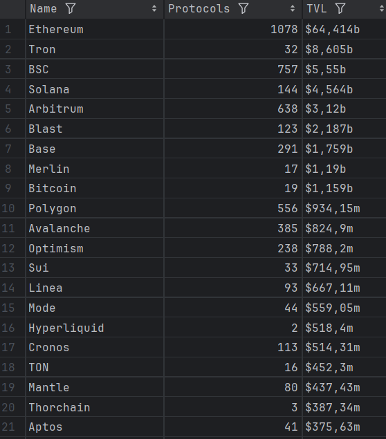

# Crypto Chains Scraper

This repository contains a script to scrape data from DeFi Llama's chains page and store it in a CSV file. The script uses Selenium for web scraping and supports configurable proxy settings and scraping intervals.

## How Setup and Execution code

### 1. Set Up the Scraping Environment

1. **Clone the repository**:
    ```sh
    git clone https://github.com/Andrii-Bezkrovnyi/crypto_parser.git
    ```

2. **Create a virtual environment**:
    ```sh
    python -m venv venv
    venv\Scripts\activate (on Windows) 
    source venv/bin/activate  (on Linux)
    ```

3. **Install the required packages**:
    ```sh
    pip install -r requirements.txt
    ```

4. **Configuring environment variables:**

   Create a .env file in the project directory with the following content:

   ```
   INTERVAL=300 # 5 minutes
   PROXY=http://your_proxy_server:port  # Replace with your actual proxy URL and port if needed

    ```

### 2. Configure Proxy Settings and Intervals for Data Collection

- **DOWNLOAD_INTERVAL**: The frequency, in seconds, at which the script will re-execute to gather data. The default is set to 300 seconds (5 minutes).
- **PROXY**: The proxy server URL. If you do not need a proxy, you can leave this variable empty or remove it from the `.env` file.

### 3. Execute the Script

1. **Run the script**:
    ```sh
    python crypto_scraper.py
    ```

   This script will start the scraping and create a file  `defillama_data.csv` with the scraped data.

2. **Set up the script to execute at the specified intervals:**:

   The script is programmed to run regularly according to the `DOWNLOAD_INTERVAL` setting.
   


3. **Logging**:
    
    The script records its operations and any errors in the info_logs.log file for debugging and monitoring

## Example of csv

